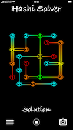
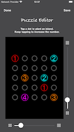
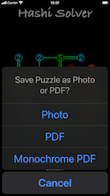
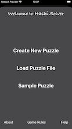

# Hashi Solver

## What this app does

* Solves Hashi puzzles that you enter using the puzzle editor.

* Saves puzzle images to your photo library.

* Stores and reloads puzzles using files in your iCloud Drive, etc.

      

## How to use

1. **Create a new puzzle.** Plant new islands by tapping on any empty space in the grid.

2. **Set the bridge counts.** Keep tapping islands to increase the number of bridges connected to them.

3. **Save the puzzle.** When you're finished building your puzzle, tap Save.

4. **Watch the solver work.** Tap the ▶️ button. Watch as the solver tries different bridge layouts.

5. **See the answer …or answers!** After the solver tries every possible combination, you will see any solutions that it found.

## Privacy Policy

* This app does not collect or upload any personal information about you or your device.

* The app only saves pictures and uploads or downloads files when you tell it to.

